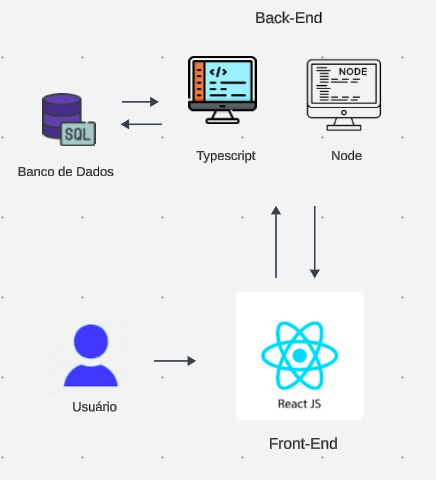

# **Arquitetura do Projeto**

## **Objetivo**

 
A arquitetura de um projeto refere-se à estrutura geral, organização e design do sistema de software. É como o projeto é organizado e como os diferentes componentes do software interagem entre si para cumprir os requisitos funcionais e não funcionais do sistema.

 
A arquitetura mostrada na imagem é uma arquitetura de software para um sistema web que usa React JS como framework de front-end e Node.js como plataforma de back-end. O sistema é composto por três camadas principais:

### Camada de apresentação:

- Responsável por exibir a interface do usuário para o cliente.
- Implementada usando React JS.
- Comunica-se com a camada de API por meio de solicitações HTTP.

### Camada de API:

- Responsável por fornecer acesso aos dados e serviços do sistema.
- Implementada usando Node.js.
- Armazena dados em um banco de dados SQL.
- Exposta como uma API RESTful.

### Camada de dados:

- Responsável por armazenar os dados do sistema.
- Implementada usando um banco de dados SQL.

## **Acesso**

Autora: Catlen Cleane
