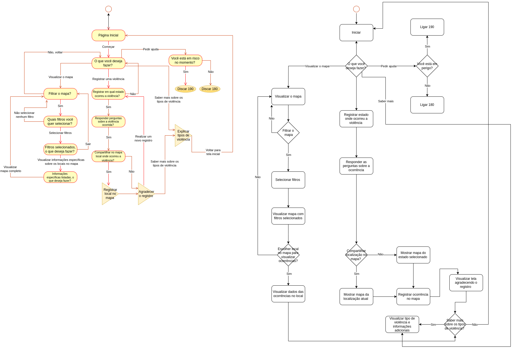

# **Fluxogramas da Interface**

## **Objetivo**

No contexto do design de interface web, um fluxograma é usado para mapear a estrutura e a navegação do site. Ele demonstra como as diferentes páginas ou telas estão conectadas entre si e como o usuário pode percorrer o site.

Portanto, criamos um fluxograma para demonstrar a árvore de decisão da interface web, delineando como os diferentes elementos e funcionalidades do site se conectam e como os usuários podem interagir com eles para alcançar seus objetivos. Isso ajudará a visualizar a estrutura do site, identificar possíveis problemas de navegação e garantir uma experiência do usuário intuitiva e fluida.

## **Acesso**

